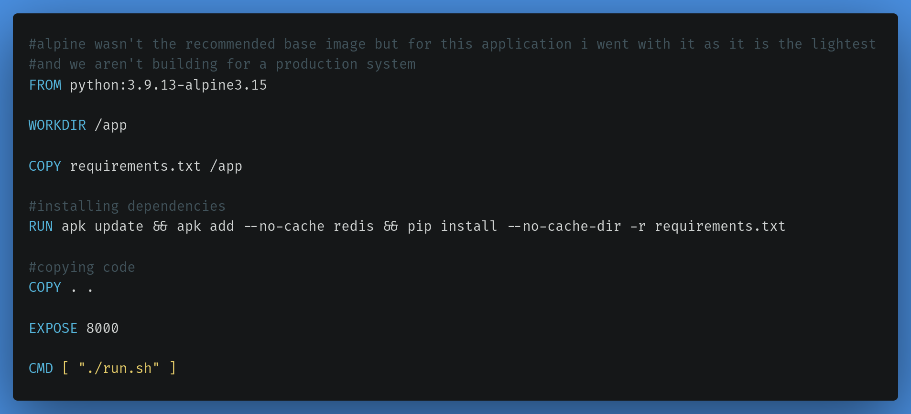

# GCP GKE project

## Description

- This project was made for GCP course.
- It is a simple reload counter made using tornado the python framework and redis hosted on GKE.

## Steps

- Cloned the app code from https://github.com/atefhares/DevOps-Challenge-Demo-Code
- Created a Dockerfile for the image  

- Created .dockerignore file to ignore unimportant files from getting containerized  
  
- Created run.sh the startup script in the docker image  

- Built the image `docker image build -t reload-count-tornado-py-app:v1.0.2alpine .`
- Tagged the image `docker tag reload-count-tornado-py-app:v1.0.1alpine gcr.io/versatile-bolt-354107/reload-count-tornado-py-app:v1.0.1alpine`
- pushed the image to GCR `docker push gcr.io/versatile-bolt-354107/reload-count-tornado-py-app:v1.0.1alpine`

- made a terraform project by running `terraform init` after creating the provider code
- wrote the rest of the infrastructure code.
- run `terraform apply`
- defined the deployment and service files.
- installed kubectl in the bastion server (private-vm).
- connect the bastion with the cluster.
- uploaded the deployment and service files to a directory on the bastion server.
- run `kubectl apply -f`

## Requirments

1. Terraform
2. Kubectl
3. Google Kubernetes Engine

## Author

[Alaa A. Amin](https://www.linkedin.com/in/alaaamin-swe/)